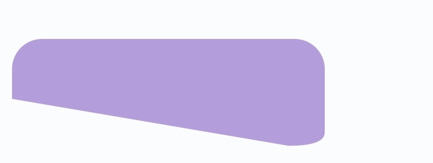
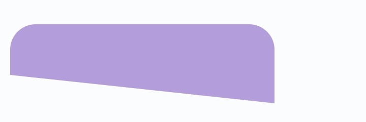
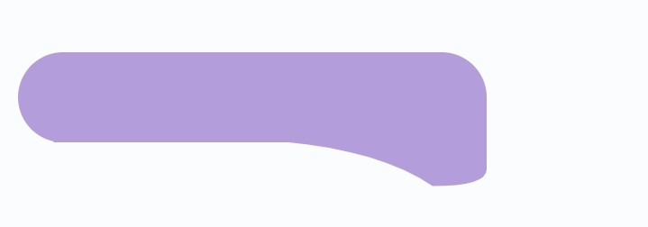
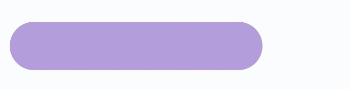
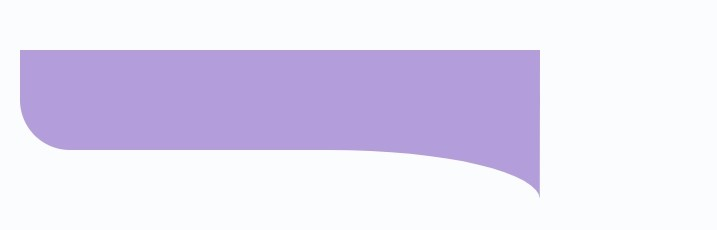

<!--
This README describes the package. If you publish this package to pub.dev,
this README's contents appear on the landing page for your package.

For information about how to write a good package README, see the guide for
[writing package pages](https://dart.dev/guides/libraries/writing-package-pages).

For general information about developing packages, see the Dart guide for
[creating packages](https://dart.dev/guides/libraries/create-library-packages)
and the Flutter guide for
[developing packages and plugins](https://flutter.dev/developing-packages).
-->

A simple but very flexible and accommodating chat shape in flutter.
This can be of help as it can save the time needed to draw different chat-like shapes.
Different shapes have been accounted for programmatically in this simple package.

## Features

The basic parameters of this widget which can be used powerfully to customize the shape are:

- Shape Handle
- Handle Cap
- Shape Radius
- Shape Height
- Shape Width
- Handle Height
- Handle Width

### Screenshots







## Getting started

To use this package, you can include the following to your `pubspec.yaml` file
```yaml
dependencies:
  flutter:
    sdk: flutter

  chat_shape:
    git:
      url: git@github.com:kenresoft/chat_shape.git
      ref: master
```

## Usage

 ```dart
Widget getShape() {
  ChatShapePainter(
    context: context,
    width: MediaQuery.of(context).size.width - 40,
    height: 200,
    color: Colors.indigo,
    applyTopRadius: true,
    enableHandle: true,
    handleHeight: 80,
    handleWidth: 100,
    radius: 30,
    enableHandleCap: false,
    handle: HandleType.curved,
  );
}
 ```

## Additional information

The code snippet for the screenshots above can be found in the 
The package is not limited to this 5 examples alone. It's flexible and can be used to generate more custom shapes.
